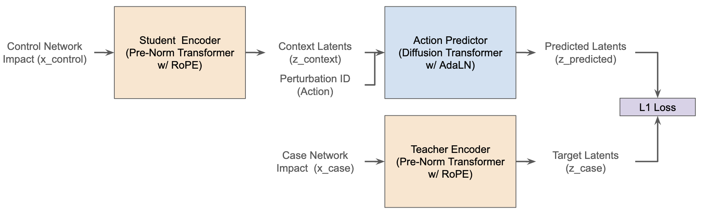

# bio-JEPA
Our goal is to build a "world model" for cells as inspired by [V JEPA 2-AC](https://github.com/facebookresearch/vjepa2). This means that a successful model learns the causal physics of cell states. Because there are billions of potential drug and gene combinations, it is impossible and too expensive for scientists to test them all in a physical lab to see what works. A successful model would act like a digital simulator that predicts the results of these experiments instantly, allowing prediction of how cell types would react to different perturbations (e.g. therapeutics, gene knockout)  

## Background / Notes

When reading the V JEPA 2 paper, we became inspired to think of the future of biological simulation differently.  The concepts that are focused on video seemed like a great fit for building a model that can learn underlying cell mechanics and and perturbation anticipation.  In particular the the V JEPA 2-AC model seemed the best fit since it's a latent action-conditioned world model.  Latent action-conditioned world model are generative system, in JEPA's case encoders, that learns to predict future environmental states by inferring its own abstract "actions" from raw data, such as video for JEPA, rather than relying on explicit human-provided labels. By encoding the transitions between frames into a compressed latent space, the model discovers a set of controllable behaviors that allow it to simulate and interact with complex environments even when the original training data lacked specific control inputs.  To us, this reads like a perfect fit where the abstract action is the cell's reaction to a perturbation and the latent space would be the relationship between the cell's pathways & regulatory networks in different cell types. 

### Target Corporate Uses

Often, these projects are undertaken more as a "is X technically possible", which, admittedly was also the start of this project.  We quickly realized that, to ensure we were doing something useful, we needed to know a few different ways that people could use a model like this so that we have a target to shoot for.  By knowing the target, we can then craft validation sets and inference harnesses to for testing our prototype harnesses.  A couple of the use cases we can think of are: 

**Use Case 1: Target Discovery** based on a gene signature.  Different teams around the world have a wide range of molecular disease signatures that they do not know how to target yet. An example could be having the signature of a specific chemotherapy resistant cancer. A common question is: "what would need to be done to these cells to add sensitivity back in".  If you wanted to do this in a wet lab you'd maybe run CRISPR based screens taking months of time and hundreds of thousands of dollars.  *How this model helps:* With a model you can create an encoding of a known version of the sensitive cell and one of the resistant cell. From this, run a series of input optimization steps to find the vector that minimizes the distance between the sensitive and resistant cell then map that vector back to a perturbation (or a couple of them). After this, the wetlab experimentation can be focused on the in-silico recommendation. 

**Use Case 2: Lead Optimization** by acting as a safety oracle. If a team has a promising candidate but they haven't yet run safety profiling (e.g. what is the toxocitiy specifically in the heart or liver).  In this example, the model understands baseline expression for different cell lines already so the user would create an embedding for the new drug (acting as the perturbation) and then pass it through the model to see the mechanism impacts on various cell types.  Based on bioloical understanding, or a finetuned head,  a user can then understand impact on the different virtual cells and can try out minor tweaks to the drug to improve the safety. 

**Use Case 3: Drug Combination** by establishing the effects of combined perturbations.  Many cancers are not cured with a single drug but knowing the right combination of drugs is extremely difficult the more there are out there. By having a model that understands baseline cell behavior and the cellular impact from the common standard-of-care regiments, a team could then use the model to test pairwise combination between the standard of care and/or with novel therapeutics.  Being able to screen these combinations and see the combined impact, teams can find the best combinations. Alternatively, a user can analyze the standard of care comapred to a healthy control cell, derive the action vector (similar to use case 1) that minimzes the difference, and then convert that backwards into a known perturbation impact. 

### Target Research Uses

Beyond just uses for therapeutic discovery, a model that learns the causal physics of a cell can also tell us a lot about biology that we do not understand yet.  A lot of this will depend on the architecture of the model and the input data, but some examples would be as follows: 

**System-Level Discovery** If our input focuses just on gene regulatory networks, the cell physics the model learns is primarily the "Circuit Board" of the cell. With this, the model ideally learns how the pathways interact, it would not have chemical or gene level information.  Because of this, the model could learn interaction patterns between networks leading to new discoveries, but it cannot discover or define brand new pathways. By analyzing the model's attention maps, we could uncover hidden regulatory logic. For example, if the attention maps showed the right relationships, we could identify that the "Hypoxia" system is a previously unknown causal trigger for "DNA Repair" machinery.

**New Mechanism Discovery** If we update our inputs to also include the molecular components of regulatroy networks and cell pathways (e.g. genes/proteins/enzymes), then the model will learn the different weights of the networks/pathways from the data. During training, if the model realizes it cannot accurately predict cell states without using a specific, previously expected to be useless, gene or enzyme, it will update the mask to include it. This allows us to mathematically prove that a previously uncharacterized component is functionally essential to a specific biological process.  A tweak of this could also allow for the dynamic dimension to be the different pathways allowing for the learning to be focused on the pathways.  

## Current Architecture

#### Data Prep

> [data_prep_explainer_genebased](https://github.com/GPTomics/biojepa/blob/main/notebooks/data_prep_explainer_genebased) is an explainer notebook 

In the current iteration of the model, we're using [Replogle et al., Cell, 2022 K562 Essential Perturb-seq Gene Perturbation Signatures](https://maayanlab.cloud/Harmonizome/dataset/Replogle+et+al.%2C+Cell%2C+2022+K562+Essential+Perturb-seq+Gene+Perturbation+Signatures) datasets.  This dataset is derived from a patient with Chronic Myelogenous Leukemia (CML)  and, using scRNA seq measures gene expression profiles following CRISPRi genetic perturbation of essential genes.  In essence, this dataset contains gene expression measurments for 48 batches of cells where there are controls and single gene knock-outs allowing you to see how a single knockout perturbation impacts the controls.   

Our data prep is fairly simple: we normalize the counts to 1e4 (10,000) and take the $log(1+x)$ for the expression. This ensures that our cell expression is not impacted by sequencing depth (count normalization) and that high expressed genes do not dominate our learning (log normalization). Since count normalization can inflate counts for less-than-viable cells, we also store the log of the pre-normalized total count giving our model a datapoint to potentially use in it's learning. For now a final step we do is take 4096 ($2^{12}$) most expressed genes cutting off some of the expression information.  This is mainly done to limit the network size.  After normalization, we take each perturbed cell (case), we pick a random control from the same batch.  We encode the perturbation for the case cell and save that along with the case and control expression information (gene expression counts, total expression counts).

Along with our expression data we want to lean a bit on known biology and so we want to give our model gene regulatory network information that shows how the genes we passed in may be interacting.  To do this we create a one-hot encoding of the genes based on regulatory network we pulled. We chose the [Drug Signatures Database (DSigDB)](https://academic.oup.com/bioinformatics/article/31/18/3069/241009) and map the genes to each regulatory network. We did find that not every gene mapped to the network, but that's okay since our regulatory network encoding will be a "suggestion" to our model and not a key input.  The model can decide to learn its own network or update existing ones as it learns.  

#### Model Architecture

>  [bioJepa_explainer.ipynb](https://github.com/GPTomics/biojepa/blob/main/notebooks/bioJepa_explainer.ipynb) is an explainer notebook 

Our current architecture has 3 models:  

1. **The Student** - starts from the control cell and learns how to create a latent embedding of the cell state. 
2. **The Predictor** - learns how to adjust the student's embedded cell state based on different perturbations to hallucinate the future diseased state in the latent space shared with the teacher. 
3. **The Teacher** - starts from the actual perturbed cell and creates a latent space embedding for the pertured state to grade the predictors output against.  

To create our latent space, we use a Pre-Norm Transformer Encoder block with Rotary Positional Embeddings (RoPE). This structure is shared by the Student and Teacher even though they learn at different rates post initiation.  The Predictor is based on a Diffusion Transformer (DiT) style block utilizing Adaptive Layer Normalization (AdaLN) and learns how to adjust the student embeddings to match the teacher embeddings based on a given perturbation. The Predictor uses `AdaLN` so that the learned Action vector is injected into every normalization layer to scale and shift the activations. This architecture effectively "swaps" the neural network's behavior based on which drug you applied istead of just scales the output. 

#### Training Loops

#### Testing / Validaiton 

### Improvements To Add

1. TO DO: Switch the current data prep to NOT collapse down the networks to a single value per example and instead maintain the gene/molecule level expression information. With this we also have to tweak the model architecture to take in the updated embeddings. 
    1. How to fix: Research how others embed perturbSeq and SC data into standard transformer based models. 
    2. Gotcha: Be sure to evaluate how to insert in more than just genes since ideally we can have any chemical modality included. 
2. TO DO: Find more datasets/better datasets
3. TO DO: do warmup learning on the encoders first, then train the predictor  with the encoders. Basically run maked prediction training on the  transformers with the data so it starts to learn what network patterns look like, then go from there. 

    1. "Representation Warmup." - Training our bioJEPA model from scratch is hard because we are asking it to solve two variables at once (x and y).

        1. **I don't know what a cell is** (Encoder is random).
        2. **I don't know what a drug does** (Predictor is random).

        If you start with random encoders, the Predictor often collapses to a trivial solution (predicting the mean) before the Encoder learns anything useful.

## Other's Approaches

To be filled in

