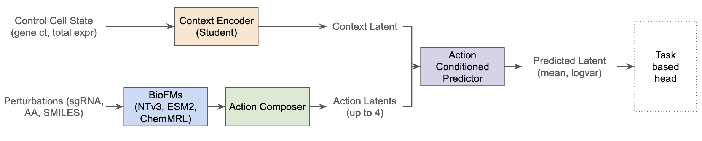
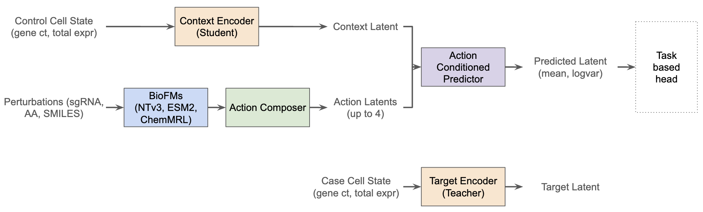
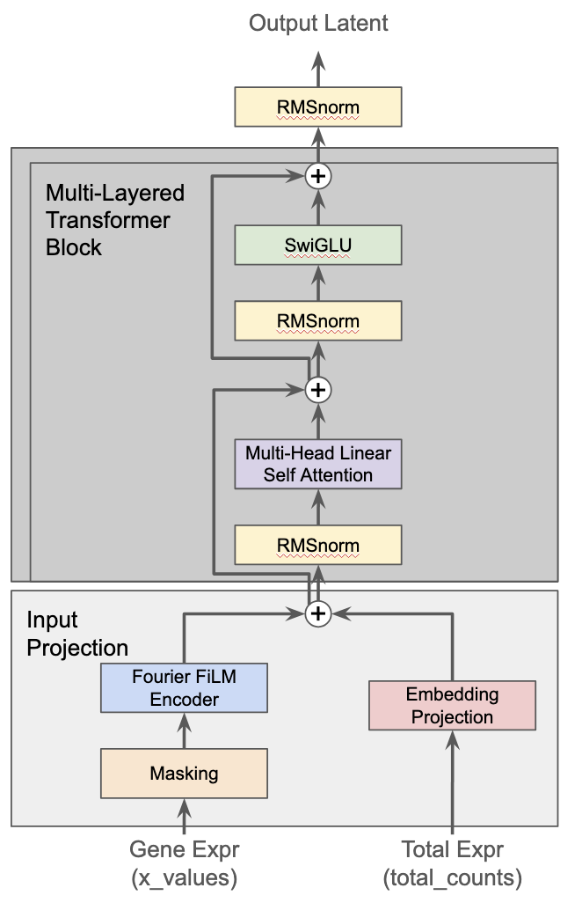
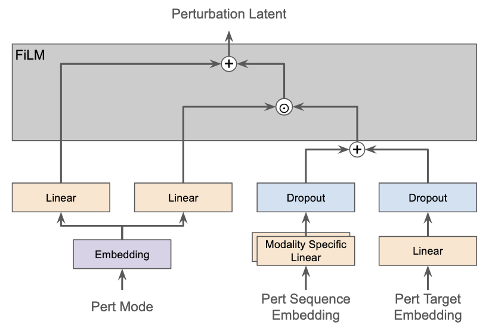
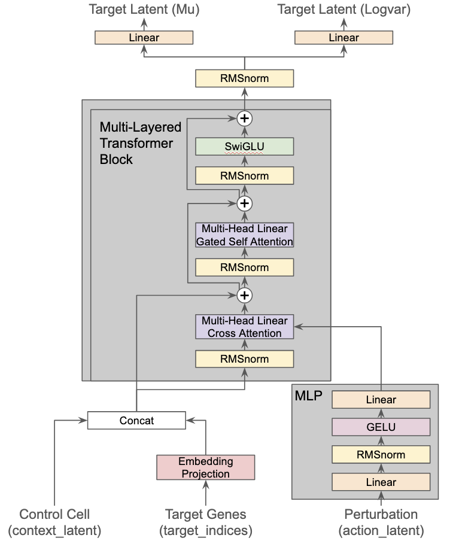

# CURRENTLY A WIP!!

# BioJEPA-AC v0.6 - A world model for cells

## Evals

### Action Conditioned Predictor

BioJEPA-AC primary benefit is not creating the joint-embedding space, but being able to take actions, in our case perturbations, and move cell representations in that embedding space.   To evaluate if our latent space and understanding of moving representations across it are useful, we use a series of evals both directly on the latent space, and with lightweight decoder heads.  

*Fig X. Forward pass of our action conditioned network*

To do the evals, we take a control cell state, add up to four perturbation representations, and then do a forward pass on our BioJEPA-AC model.  This generates a representation of the perturbed cell state, after which we pass that to the task eval.   We have 8 different evals that we do on our fully trained model. 

### Eval Heads

#### Linear Expression Decoder

#### Linear Classifier

### Full Model Evals

#### Expression Prediction

The main goal of this eval is to see if we can predit post perturbation gene expression.  This eval is useful as a high accuracy in gene expression can lead to an explainable understanding on perturbation effects for viability and gene network impact. In v0.6 we're focusing on 10,000 genes. Since we're covering almost half of the known genes, many of the genes will not have signficant changes. This means that we have to be careful to not evaluate just the whole gene set as predicting no change can be highly accurate for most genes.   To avoid falling into this trap, we run a number of different analyses including focusing on the top 20 and top 50 differentially expressed genes allowing us to see if the model is able to predict the largest movement vs just the housekeeping genes.  

#### Gene Level Analysis

#### Perturbation Retrieval

#### Uncertainty Calibration

#### Action Vector Pathway

#### Mechanism of Action Matching

#### Combination Perturbation Impact

#### Dose Response

## Abstract

This report presents an updated view on BioJEPA-AC (Biological Joint-Embedding Predictive Architecture - Action Conditioned), a joint-embedding predictive architecture that uses a shared latent space to learn cell dynamics and perturbation response.

## Model Architecture

### Overview

*Fig X. BioJEPA-AC v0.6 inference overview highlighting how a cell state and a perturbation are converted into a mean and variance latents representing the cell state*

The v0.6 BioJEPA-AC architecture is designed to create predict a latent representation of cell state given it's baseline cell state and up to 4 different perturbatios.  The model is designed to handle cell states represented across 10,000 genes with continuous value expression counts that may have extreme sparsity inherent to Perturb-seq data.  Through the use industry foundation models and the action composer, the model can handle up to 4 combined predefined or novel perturbations across different modalities. The architecture comprises of the following modules: 

* **Cell State Encoder**:  This transformer based module maps the latent space representing cell states. It builds the latent space based on the relative gene expression and total cell expression. It is used for both the *Context Encoder* and *Target Encoder*.
* **Action Composer**:  This module is a dual-pathway encoder with additive fusion and FiLM-based mode conditioning.  It creates a unified latent space for the embedding representations of the different types of perturbations.
* **Action Conditioned Predictor**: This transformer based module uses the action latents to adjust the cell state representation in the latent space to generate the latent representation of the perturbed cell state.

### Cell State Encoder

*Fig X. The data that creates our cell state representation in the latent space*

The cell state encoder architecture is our foundation fo the joint-embedding pretrained architecture. This architecture is both used for our context encoder (student) and target encoder (teacher).  The encoder is a transformer-based with linear attention, SwiGLU and RMSNorm. We use both the count/log normalized expression counts and the sum of total expression to build out our cell latent.  We include the total expression sum to ensure our models have a way to flag unviable cells that would look like just "noisy" expression if we were to only look at the normalized per gene expression.  Our cell representation ends with a representation in the $[\text{token},\text{embedding}]$  space.  Currently the tokens for the cell are the different genes that we have expression infromation for, so in  the case of v0.6, the 10,000 highest expressed genes across our datasets.  The architecture though is built that we can expand to non-gene based cell representaed tokens. Review our [explainer](https://github.com/GPTomics/biojepa/blob/main/layer_explainers/explainer_cell_state_encoder.ipynb) notebook for a deeper dive.

### Action Composer

*Fig X. An overview of how we merge different types of perturbations with different data into the same perturbation representation.*

The action composer is a dual-pathway linear encoder that projects perturbation embeddings into a shared latent space via separate linear projections, fuses them, and applies FiLM conditioning from a learned mode embedding to encode the perturbation with mechanism aweareness. This architecture allows us to pull our different perturbations into the same unified perturbation space and can then feed it into our action-conditioned predictior. Our perturbation representation ends with a representation in the $[\text{n\_perts},\text{pert\_embedding}]$  space.

This architecture is designed to suppor our goal of cells with multiple perturbations (up to 4 for v0.6) that may be different modalities and modes.  Perturbations can be targeted genetic (e.g. CRISPR) perturbations or therpeutics ranging from nucleic acids, proteins, and small molecules. We require a perturbations has either a sequence and/or target (at least one), and the mode (crispri, crispra, overexpression, knockout, inhibitor, agonist, degrader, binder, unknown).  To improve our flexibility and generalization of our action composer, instead of taking in the raw representation of the sequence and target, during data prep we pass them through bio foundation models to get embedding representations. We rely on the action composer understanding how to create embeddings to represent functionally similar, sequence different perturbations. By leveraging the BioFMs, we can easily expand to unseen and completely novel perturbations. Review our [explainer](https://github.com/GPTomics/biojepa/blob/main/layer_explainers/explainer_action_composer.ipynb) notebook for a deeper dive.

### Action Conditioned Predictor

*Fig X. An overview of how we shift the cell state in the shared latent based on the pertrubation*

The action conditioned predictor architecture is the foundation of the "AC" portion of our BioJEPA-AC model.  The predictor is transformer-based with smilar linear attention, SwiGLU, and RMSNorm.  It differs from the cell state encoder since it employs two different attention layers: cross attention to shift the cell state based on the pertrubation, and self attention to allow the cell state to learn from itself. The predictor uses a target indices to allow for predicting only a portion of the cell state representation, similar to how masked models operate.  It fuses the un-perturbed cell representation generated by the context encoder with the targets, and then uses attention to layer in the action latent generated from the action composer.  The predictor generates a predicted representation of the perturbed cell state including an uncertainty estimate, each of which is represented in the  $[\text{token},\text{embedding}]$  space. The idea is that this is the shared latent space that the cell state encoder learns and the predictor is just learning where to move the representation based on all of the perturbations. 

Review our [explainer](https://github.com/GPTomics/biojepa/blob/main/layer_explainers/explainer_ac_predictor.ipynb) notebook for a deeper dive.

---

# Evals

### Encoder Training Evals

        'batch_invariance': _batch_invariance(ctx),
        'gene_embedding_pathways': _gene_embedding_pathways(ctx),
        'essential_gene_prediction': _essential_gene_prediction(ctx),
        'cell_type_probing': _cell_type_probing(ctx),
        'reconstruction': _reconstruction(ctx),
        'perturbation_detection': _perturbation_detection(ctx),
        'embedding_consistency': _embedding_consistency(ctx),
        'latent_space_health': _latent_space_health(ctx),

**Batch invariance**

* batch classifier - accuracy, chance, above chance ratio
* perturb classifier - accuracy, chance, above chance ratio

**Gene Embedding Pathways**

* Silhouette score, knn accuracy, knn std, n classes, n samples
* Datasets: Kegg, Reactome

**Essential Gene Prediction**

* regression: pearsons, spearman
* classification: auroc, n_essentia_test, n_non_essential_test

**Cell Type Probing**

* Accuracy, Macro F1, Chance, Above chance ratio

**Reconstruction**

* MSE, Pearson R, Pearson R^2 

**Perturbation Detection**

* Aurora, accuracy, chance

**Embedding Consistency**

-  intra distance, inter distance, inter intra ratio, 

**Latent Space Health**

- effective dimensionality, variance, isotropy

### Copmposer Training Evals

### AC Training Evals

# Training

# Data Prep

# Bayesian Optimization

