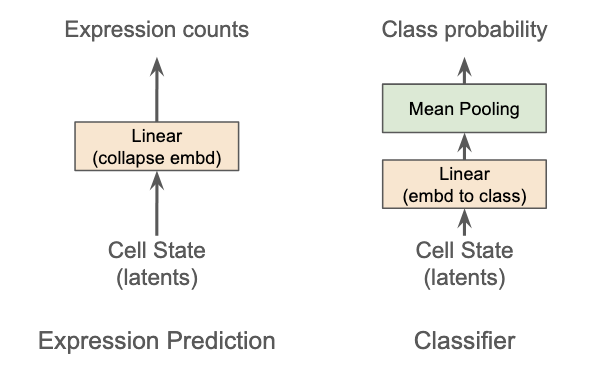

# CURRENTLY A WIP!!

# BioJEPA-AC v0.6 - A world model for cells

## Abstract

We present an updated view on BioJEPA-AC (Biological Joint-Embedding Predictive Architecture - Action Conditioned), a joint-embedding predictive architecture that uses a shared latent space to learn cell dynamics and perturbation response.

`<TO BE FINISHED AT THE END>`

## Model Architecture

### Overview

*Fig X. BioJEPA-AC v0.6 inference overview highlighting how a cell state and a perturbation are converted into mean and variance latent representations of the perturbed cell state*

Our v0.6 architecture predicts a latent representation of cell state given its baseline cell state and up to 4 predefined or novel perturbations across different modalities. We represent cell states across 10,000 genes with continuous-valued expression counts that may have extreme sparsity inherent to Perturb-seq data. The architecture comprises the following modules:

* **Cell State Encoder**: A transformer-based module that maps cell states into a latent space based on relative gene expression and total cell expression. It serves as both the *Context Encoder* and *Target Encoder*.
* **Action Composer**: A dual-pathway encoder with additive fusion and FiLM-based mode conditioning that creates a unified latent space for the embedding representations of different perturbation types.
* **Action Conditioned Predictor**: A transformer-based module that uses the action latents to adjust the cell state representation in the latent space, generating the latent representation of the perturbed cell state.

### Cell State Encoder

*Fig X. The data that creates our cell state representation in the latent space*

The cell state encoder is the foundation of our joint-embedding architecture, serving as both the context encoder (student) and target encoder (teacher). The encoder is transformer-based with linear attention, SwiGLU, and RMSNorm. It uses both the count/log normalized expression counts and the sum of total expression to build our cell latent. We include the total expression sum to ensure the model can flag unviable cells that would look like "noisy" expression if we only used the normalized per-gene expression. Our cell representation lives in the $[\text{token},\text{embedding}]$ space, where tokens correspond to genes. We designed the architecture so we can expand to non-gene-based tokens. Review our [explainer](https://github.com/GPTomics/biojepa/blob/main/layer_explainers/explainer_cell_state_encoder.ipynb) notebook for a deeper dive.

### Action Composer

*Fig X. An overview of how we merge different types of perturbations with different data into the same perturbation representation.*

The action composer is a dual-pathway linear encoder that projects perturbation embeddings into a shared latent space via separate linear projections, fuses them, and applies FiLM conditioning from a learned mode embedding to encode the perturbation with mechanism awareness. Our perturbation representation ends in the $[\text{n\_perts},\text{pert\_embedding}]$ space.

Perturbations can be targeted genetic (e.g. CRISPR) perturbations or therapeutics including nucleic acids, proteins, and small molecules. We require that a perturbation has a sequence and/or target (at least one), and the mode (crispri, crispra, overexpression, knockout, inhibitor, agonist, degrader, binder, unknown). To improve flexibility and generalization, we pass the raw sequence and target representations through bio foundation models during data prep rather than feeding them directly to the composer. We rely on the action composer to learn embeddings that represent functionally similar but sequence-different perturbations, enabling expansion to unseen perturbations. Review our [explainer](https://github.com/GPTomics/biojepa/blob/main/layer_explainers/explainer_action_composer.ipynb) notebook for a deeper dive.

### Action Conditioned Predictor

*Fig X. An overview of how we shift the cell state in the shared latent based on the perturbation*

The action conditioned predictor is the foundation of the "AC" portion of our BioJEPA-AC model. The predictor is transformer-based with similar linear attention, SwiGLU, and RMSNorm. It differs from the cell state encoder by employing two different attention layers: cross-attention to shift the cell state based on the perturbation, and self-attention to allow the cell state to learn from itself. The predictor uses target indices to predict only a portion of the cell state representation, similar to how masked models operate. It fuses the unperturbed cell representation from the context encoder with the target tokens, then uses cross-attention to incorporate the action latents from the action composer. The predictor outputs a predicted representation of the perturbed cell state including an uncertainty estimate, each in the $[\text{token},\text{embedding}]$ space. It operates in the same shared latent space as the cell state encoder, learning where to move the representation based on the perturbations.

Review our [explainer](https://github.com/GPTomics/biojepa/blob/main/layer_explainers/explainer_ac_predictor.ipynb) notebook for a deeper dive.

## Evals

### Full Model Evaluation

BioJEPA-AC's primary benefit is not creating the joint-embedding space, but being able to take actions, in our case perturbations, and move cell representations in that embedding space. To evaluate whether our latent space and our ability to move representations across it are useful, we use a series of evals both directly on the latent space and with lightweight decoder heads.

*Fig X. Forward pass of our action conditioned network*

To run evals, we take a control cell state, add up to four perturbation representations, and do a forward pass through BioJEPA-AC, generating a predicted perturbed cell state representation that we then pass to the task-specific eval. We run 7 different evals on our fully trained model.

### Eval Heads

Since BioJEPA-AC is an encoder, its output is an embedding, not a directly interpretable value. To evaluate biological utility, we add decoder heads on top but keep them intentionally simple (a single linear layer each) so they don't mask issues in the base model. We use two heads: a linear expression decoder and a linear classifier.

*Fig X. An overview of the different heads, an expression predictor and a general linear classifier, we use to conduct evaluation benchmarking on our BioJEPA-AC model*

#### Linear Expression Decoder

Since our cell state latent representation is $[\text{n\_genes}, \text{embed\_dim}]$, the decoder projects each gene's embedding to a scalar expression value through its single linear layer. Our model outputs both a mean and log-variance (logvar) representation, but we feed only the mean into this decoder, reserving the logvar for uncertainty analysis.

#### General Linear Classifier

We also use a general purpose linear classifier for predicting input metadata and classes (e.g. cell batch information, cell types, perturbation status, modes, pathways) from latent representations. The classifier projects the latent to the class dimension through a single linear layer, producing raw logits per class. In some cases like classifying a cell latent to a cell type, we add a mean-pooling step to collapse per-gene predictions to per-cell without giving the model more intelligence. We leave outputs as raw logits since our different evals post-process them in different ways.

### Eval Data Splits - Hold Out

To create our hold-out datasets, we targeted an 85% / 5% / 10% train / val / test split, with actual percentages varying slightly by dataset due to cross-dataset perturbation overlap. We first used the [GEARS python package](https://github.com/snap-stanford/GEARS/tree/master) to identify the held-out train / val / test split for Replogle K562-essential. This dataset uses a 67.5% / 7.5% / 25.0% train / val / test split, which we adopted as our starting point. The split identifies unique perturbations to hold out. Starting from this, we built a hold-out perturbation list that ensures we hit 15% held-out perturbations per dataset and that those perturbations are held out across all datasets. This ensures we have no perturbation leakage, and allows a direct head-to-head comparison on the Replogle K562-essential dataset using the GEARS-defined held-out set.

For the remaining datasets, where we extracted perturbations at random, we compare against published numbers. Where feasible, we plan to re-run comparison models on our splits.

### Expression Prediction

We use this eval to measure how well our model predicts post-perturbation gene expression. High accuracy here provides interpretable insight into perturbation effects on viability and gene networks. Since most of our 10,000 genes will not change significantly for any given perturbation, predicting no change can be highly accurate. To avoid this trap, we run analyses at multiple granularities including focusing on the top 20 and top 50 differentially expressed genes.

While we've done a number of different analyses, we cover the following commonly performed evals. A major component of our expression benchmark is not looking at the raw prediction made by the linear expression decoder, but the relative prediction to the predicted control. Our baseline *real delta* is simply the observed change in expression: $\delta_g = x^{\text{case}}_g - x^{\text{ctrl}}_g$. To get our *predicted delta*, we pass both the predicted and control latent representations through the linear expression decoder and compute the difference: $\hat{\delta}_g = \hat{x}^{\text{case}}_g - \hat{x}^{\text{ctrl}}_g$. We use the predicted control expression to isolate our expression prediction into terms of BioJEPA-AC's learned latent space, ensuring that if the model learns a different baseline for the control but knows the distance to move the case cell, it can still score well. The expression deltas only work for some of our evals while others rely on absolute prediction. For our *real absolute* expression, we use the observed case expression directly. For our *predicted absolute*, we add our predicted delta to our real control: $\hat{x}^{\text{abs}}_g = x^{\text{ctrl}}_g + \hat{\delta}_g$. These four values, along with our control, form the basis of our evaluation benchmark.

For each of the following evaluations, we'll explain how the calculation is done and BioJEPA-AC's performance by dataset. For a detailed breakdown on how the evaluations are calculated see our [explainer notebook](https://github.com/GPTomics/biojepa/blob/main/layer_explainers/explainer_eval_expr_prediction.ipynb).

#### Sample Level Evaluation

We run evaluations at the sample level, calculating per sample in the test set and then aggregating the per-sample results. We build our corpus by pairing case and control cells together based on the batch identifiers in a dataset. That pairing, along with the perturbation information, creates our unique sample.

##### Sample Level Pearson's Correlation Coefficient For Top 20 DEGs

For each sample, we calculate Pearson's $r$ between the *predicted delta* and *real delta* on the top 20 differentially expressed genes (DEGs), selecting the genes with the largest absolute *real delta*. We use $K=20$ at the sample level since individual samples have noisier delta estimates than perturbation-level means. Even if the predicted magnitudes are off, a high correlation indicates our model has learned the correct expression profile. We calculate:
$$
\text{Pearson }r_{\text{sample}} = \frac{1}{N}\sum_{i=1}^{N}\frac{\sum_{k=1}^{K}(\hat{\delta}_{i,k} - \bar{\hat{\delta}}_i)(\delta_{i,k} - \bar{\delta}_i)}{\sqrt{\sum_{k=1}^{K}(\hat{\delta}_{i,k} - \bar{\hat{\delta}}_i)^{2}} \cdot \sqrt{\sum_{k=1}^{K}(\delta_{i,k} - \bar{\delta}_i)^{2}}}
$$

Where $K=20$ genes are selected per sample as the largest $|\delta_{i,k}|$.

|Dataset|BioJEPA-AC v0.6|
|-|-|
| Adamson|0.8330|
| Replogle K562 essential|0.8473|
| Replogle K562 genome-wide|0.8900|
| Norman|0.7634|
| Sciplex|0.8411|

#### Perturbation Level Evaluation

We run evaluations at the perturbation level, defining a unique perturbation as a distinct combination of sequence, target, modality, mode, and cell type. We first compute our expression values (*real delta*, *predicted delta*, *real absolute*, *predicted absolute*, *control absolute*) at the sample level, then take the mean across all samples for each perturbation.

##### Perturbation Level Mean Pearson Correlation Coefficient on Absolute Expression

We calculate Pearson's correlation per perturbation on absolute expression values across all genes. Because we run on all genes, the baseline expression pattern dominates this metric, measuring how well our model learns which genes a perturbation has minimal impact on:
$$
\text{Pearson }r_{\text{pert}} = \frac{1}{P}\sum^{P}_{p=1}\frac{\sum^{K}_{k=1}(\hat{y}_{p,k} - \bar{\hat{y}}_{p})(y_{p,k} - \bar{y}_{p})}{\sqrt{\sum^{K}_{k=1}(\hat{y}_{p,k} - \bar{\hat{y}}_{p})^{2}} \cdot \sqrt{\sum^{K}_{k=1}(y_{p,k} - \bar{y}_{p})^{2}}}
$$

Where $\hat{y}_{p,k}$ and $y_{p,k}$ are the predicted and real absolute expression for perturbation $p$, gene $k$, already averaged over all samples of that perturbation. The bars ($\bar{\hat{y}}_{p}$, $\bar{y}_{p}$) are means across genes for centering within each perturbation's Pearson computation. Three key differences from the sample-level calculation: we use absolute expression instead of deltas, perturbation means instead of individual samples, and all genes instead of the top-20 DEGs.

|Dataset|BioJEPA-AC v0.6|
|-|-|
| Adamson|0.9828|
| Replogle K562 essential|0.9758|
| Replogle K562 genome-wide|0.9858|
| Norman|0.9802|
| Sciplex|0.9660|

##### Perturbation Level Mean Pearson Correlation Coefficient on Expression Delta

We also calculate Pearson's correlation per perturbation on expression deltas for all genes:

$$
\text{Pearson }\Delta r_{\text{pert}} = \frac{1}{P}\sum^{P}_{p=1}\frac{\sum^{K}_{k=1}(\hat{\delta}_{p,k} - \bar{\hat{\delta}}_{p})(\delta_{p,k} - \bar{\delta}_{p})}{\sqrt{\sum^{K}_{k=1}(\hat{\delta}_{p,k} - \bar{\hat{\delta}}_{p})^{2}} \cdot \sqrt{\sum^{K}_{k=1}(\delta_{p,k} - \bar{\delta}_{p})^{2}}}
$$

Where $\hat{\delta}_{p,k}$ and $\delta_{p,k}$ are the predicted and real expression deltas for perturbation $p$, gene $k$, already averaged over all samples of that perturbation. The bars ($\bar{\hat{\delta}}_{p}$, $\bar{\delta}_{p}$) are the means across genes, used for centering within each perturbation's Pearson computation.

The thousands of unchanged genes where prediction and ground truth share the same control baseline can inflate Pearson on absolute expression. Pearson on deltas strips that shared signal, forcing correlation to come entirely from correctly predicting the perturbation effect. However, deltas have lower variance and are centered near zero, so the centering step has less to work with and the few changed genes have outsized influence, making this a harder metric.

|Dataset|BioJEPA-AC v0.6|
|-|-|
| Adamson|0.0181|
| Replogle K562 essential|0.2213|
| Replogle K562 genome-wide|0.2318|
| Norman|0.2861|
| Sciplex|0.0781|

##### Perturbation Level Mean Coefficient of Determination $R^2$ For Top 50 DEGs

We calculate $R^2$ between our real and predicted absolute expression values on the top 50 differentially expressed genes for each perturbation, measuring how much variance in the real expression our predictions capture for the most affected genes.

$$
R^{2}_{\text{top 50}} = \frac{1}{P}\sum^{P}_{p=1}\left(1 - \frac{\sum_{k \in \mathcal{D}_{p}}(\hat{y}_{p,k} - y_{p,k})^{2}}{\sum_{k  
  \in \mathcal{D}_{p}}(y_{p,k} - \bar{y}_{p})^{2}}\right)
$$

Where $\mathcal{D}_{p}$ is the set of 50 genes with the largest $|\delta_{p,k}|$ for perturbation $p$, and $\bar{y}_{p} = \frac{1}{|\mathcal{D}_{p}|}\sum_{k \in \mathcal{D}_{p}} y_{p,k}$. Note that while the top-50 genes are selected by delta magnitude, $R^2$ itself is computed on absolute expression values. Since we already have the linear correlation of all genes calculated using Pearson's coefficient, we focus $R^2$ on just the top differentially expressed genes, which tests whether our model accurately captures the magnitude of expression changes at the genes most affected by the perturbation. Unlike Pearson's correlation, $R^2$ penalizes magnitude errors, so simply echoing the control state is not enough.

|Dataset|BioJEPA-AC v0.6|
|-|-|
| Adamson|0.8316|
| Replogle K562 essential|0.7834|
| Replogle K562 genome-wide|0.8282|
| Norman|0.6794|
| Sciplex|0.9562|

#### Cross-Perturbation Evaluation

We run evaluations across our perturbation expression profiles. While these evaluations still look at the expression prediction mean per perturbation, they evaluate the predictions against one another to test whether our model can distinguish between different perturbations.

##### Cross Perturbation Centroid Accuracy

We compare each predicted delta vector against all real delta vectors to find the nearest match. For this calculation, we change how we define a unique perturbation. Since this metric cares mainly about perturbation effect, we re-group our perturbations by taking the mean expression delta across perturbations sharing the same target protein (or sequence if target is unavailable), mode, and cell type. This avoids asking the model to differentiate between different perturbations targeting the same protein. We calculate centroid accuracy as:
$$
\text{Centroid Accuracy} = \frac{1}{G}\sum^{G}_{g=1} \mathbb{1}\left[\underset{h}{\arg\min}\, \|\hat{\delta}_{g} - \delta_{h}\|^{2}= g\right]
$$
Where $G$ is the number of unique perturbation target groups, and $\hat{\delta}_{g}$, $\delta_{g}$ are gene-length vectors of mean predicted and real expression deltas for group $g$. This metric becomes harder with more unique perturbations, especially when multiple perturbations share a similar target mechanism.

|Dataset|BioJEPA-AC v0.6|
|-|-|
| Adamson|0.2222|
| Replogle K562 essential|0.0175|
| Replogle K562 genome-wide|0.0684|
| Norman|0.1250|
| Sciplex|0.1429|

##### Cross Perturbation Severity Correlation

We measure whether our model accurately predicts the overall strength of each perturbation's effect. Using the same perturbation-level mean deltas, we compute the L2 norm (Euclidean magnitude) of both the real and predicted expression delta vectors, reducing each to a scalar severity score. We then calculate Pearson's correlation across perturbations between these severity scores:

$$
\begin{aligned}
s_p &= \|\delta_p\|_2 = \sqrt{\sum_{k=1}^{K} \delta_{p,k}^{2}}   \\
\hat{s}_{p} &= \|\hat{\delta}_{p}\|_2 = \sqrt{\sum_{k=1}^{K} \hat{\delta}_{p,k}^{2}} \\
\text{Pearson }\Delta r_{\text{severity}} &= \frac{\sum_{p=1}^{P}(\hat{s}_{p} - \bar{\hat{s}})(s_{p} - \bar{s})}{\sqrt{\sum_{p=1}^{P}(\hat{s}_{p} - \bar{\hat{s}})^{2}}\;\sqrt{\sum_{p=1}^{P}(s_{p} - \bar{s})^{2}}}
\end{aligned}
$$

Where $s_p$ and $\hat{s}_{p}$ are the real and predicted severity scores for perturbation $p$, computed as the L2 norm across all $K$ genes. A high severity correlation indicates our model knows which perturbations have large effects versus small, even if it doesn't perfectly predict the per-gene pattern.

|Dataset|BioJEPA-AC v0.6|
|-|-|
| Adamson|0.1063|
| Replogle K562 essential|0.2314|
| Replogle K562 genome-wide|0.7981|
| Norman|-0.2724|
| Sciplex|-0.2460|

### Gene Level Analysis

We use this eval to assess whether our model correctly identifies which genes are affected by a perturbation and in which direction. Unlike expression prediction, which measures magnitude accuracy, gene level analysis focuses on categorical behavior across differentially expressed genes. These evaluations rely on the same perturbation-level mean *real delta* and *predicted delta*.

For each of the following evaluations, we'll explain how the calculation is done and BioJEPA-AC's performance by dataset. For a detailed breakdown on how the evaluations are calculated see our [explainer notebook](https://github.com/GPTomics/biojepa/blob/main/layer_explainers/explainer_eval_gene_analysis.ipynb).

##### Directional Accuracy For Top 50 DEGs

We measure whether our model correctly predicts if a differentially expressed gene is up-regulated or down-regulated. We first classify each gene's expression delta into one of three categories using a threshold:
$$
d(\delta_k) = \begin{cases} +1 & \text{if } \delta_k \geq \tau \\ -1 & \text{if } \delta_k \leq -\tau \\ 0 & \text{otherwise} \end{cases}
$$

Where $\tau = 0.25$ is the direction threshold. We apply this classification to both our real and predicted perturbation-level mean expression deltas, then select the top 50 DEGs per perturbation based on the largest absolute real expression delta. We then compare how many of those genes the prediction classified correctly:

$$
\text{Direction Accuracy}_{topK} = \frac{1}{P \cdot K} \sum_{p=1}^{P} \sum_{k \in \mathcal{T}_p} \mathbb{1}\left[d(\hat{\delta}_{p,k}) = d(\delta_{p,k})\right]
$$

Where $\mathcal{T}_{p}$ is the set of $K=50$ genes with largest $|\delta_{p,k}|$ for perturbation $p$. Since we select the top 50 out of 10,000 genes, we typically focus on genes with large expression changes, but perturbations with lower overall cell impact and fewer significantly moving genes make this a harder metric.

|Dataset|BioJEPA-AC v0.6|
|-|-|
| Adamson|0.6511|
| Replogle K562 essential|0.3712|
| Replogle K562 genome-wide|0.7072|
| Norman|0.3275|
| Sciplex|0.8645|

### Uncertainty Calibration

We use this eval to assess whether our model's uncertainty estimates are meaningful. BioJEPA-AC outputs both a mean and log-variance latent representation for the perturbed cell state. We average the log-variance across genes per sample as our uncertainty signal, and compute MSE between the *predicted delta* and *real delta*, also averaged across genes:

$$
\begin{aligned}
u_s &= \frac{1}{K}\sum_{k=1}^{K} \text{logvar}_{s,k} \\
e_s &= \frac{1}{K}\sum_{k=1}^{K} (\hat{\delta}_{s,k} - \delta_{s,k})^2
\end{aligned}
$$

Where $u_s$ and $e_s$ are the scalar uncertainty and MSE for sample $s$, averaged across all $K$ genes. A well-calibrated model should produce higher uncertainty for samples where it makes larger errors. These evals currently perform poorly, and we are exploring training and post-training techniques to improve calibration.

For each of the following evaluations, we'll explain how the calculation is done and BioJEPA-AC's performance by dataset. For a detailed breakdown on how the evaluations are calculated see our [explainer notebook](https://github.com/GPTomics/biojepa/blob/main/layer_explainers/explainer_eval_uncertainty_calibration.ipynb).

##### Expected Calibration Error (ECE)

We measure calibration using ECE, which quantifies the gap between predicted uncertainty and actual error across binned samples. We first min-max normalize both uncertainty and MSE to $[0, 1]$, then partition samples into 10 equal-width bins by normalized uncertainty. We calculate ECE as:

$$
\text{ECE} = \sum_{b=1}^{10} \frac{|\mathcal{B}_b|}{N} \left| \bar{u}_b - \bar{e}_b \right|
$$

Where $\mathcal{B}_b$ is the set of samples in bin $b$, $N$ is the total number of samples, and $\bar{u}_b$, $\bar{e}_b$ are the mean normalized uncertainty and mean normalized error within bin $b$. A perfectly calibrated model achieves ECE = 0, meaning its uncertainty directly tracks its error in every bin.

|Dataset|BioJEPA-AC v0.6|
|-|-|
| Adamson|0.1401|
| Replogle K562 essential|0.3240|
| Replogle K562 genome-wide|0.5964|
| Norman|0.2098|
| Sciplex|0.2892|

##### Perturbation Level Uncertainty-Error Pearson Correlation

We aggregate uncertainty and MSE to the perturbation level by taking the mean across all samples for each perturbation. We then calculate Pearson's correlation between per-perturbation mean uncertainty and mean MSE:

$$
r_{\text{unc}} = \frac{\sum_{p=1}^{P}(u_p - \bar{u})(e_p - \bar{e})}{\sqrt{\sum_{p=1}^{P}(u_p - \bar{u})^2} \cdot \sqrt{\sum_{p=1}^{P}(e_p - \bar{e})^2}}
$$

Where $u_p$ and $e_p$ are the mean uncertainty and mean MSE for perturbation $p$, already averaged over all samples of that perturbation. The bars ($\bar{u}$, $\bar{e}$) are means across perturbations for centering. Perturbation-level aggregation smooths out sample noise, so a meaningful uncertainty signal should correlate more strongly at this level than at the sample level.

|Dataset|BioJEPA-AC v0.6|
|-|-|
| Adamson|0.0216|
| Replogle K562 essential|0.0529|
| Replogle K562 genome-wide|0.2662|
| Norman|-0.0155|
| Sciplex|-0.1781|

### Mechanism of Action (MoA) Matching

We use this eval to assess whether perturbations affecting the same biological pathway produce similar changes in the latent representation and predicted expression changes. This tests whether our model has learned pathway-level biology, not individual perturbation effects alone. We map each perturbation to its target gene, assign that gene to one or more pathways using [KEGG Pathways 2026](https://maayanlab.cloud/Harmonizome/dataset/KEGG+Pathways+2026), and compute pairwise cosine similarity between the perturbation-level mean *predicted delta* vectors:

$$
\text{sim}(\hat{\delta}_i, \hat{\delta}_j) = \frac{\sum_{k=1}^{K} \hat{\delta}_{i,k} \cdot \hat{\delta}_{j,k}}{\sqrt{\sum_{k=1}^{K} \hat{\delta}_{i,k}^{2}} \cdot \sqrt{\sum_{k=1}^{K} \hat{\delta}_{j,k}^{2}}}
$$

Where $\hat{\delta}_i$ and $\hat{\delta}_j$ are the mean *predicted delta* vectors (latent delta or expressoin delta) for perturbations $i$ and $j$, and $K$ is the number of genes.

For the following evaluation, we'll explain how the calculation is done and BioJEPA-AC's performance by dataset. For a detailed breakdown on how the evaluations are calculated see our [explainer notebook](https://github.com/GPTomics/biojepa/blob/main/layer_explainers/explainer_eval_moa_matching.ipynb).

##### Within/Between Pathway Similarity Ratio

We classify each pairwise similarity as *within* (the two perturbations share at least one common pathway) or *between* (no common pathway). We take the mean of each group, compute their ratio, and test for statistical significance using a Mann-Whitney U test:

$$
\begin{aligned}
\text{ratio} &= \frac{\bar{s}_{\text{within}}}{\bar{s}_{\text{between}}} \\
U &= \sum_{i=1}^{n_w} \sum_{j=1}^{n_b} \mathbb{1}[s_{\text{within},i} > s_{\text{between},j}] \\
z &= \frac{U - \frac{n_w \cdot n_b}{2}}{\sqrt{\frac{n_w \cdot n_b \cdot (n_w + n_b + 1)}{12}}} \\
p &= 1 - \Phi(z)
\end{aligned}
$$

Where $n_w$ and $n_b$ are the number of within-pathway and between-pathway pairs, $U$ counts how many times a within-pathway similarity exceeds a between-pathway similarity, and $\Phi$ is the standard normal CDF. A ratio above 1.0 with a small $p$-value indicates our model has learned to group same-pathway perturbations with statistical significance.

|Dataset|BioJEPA-AC v0.6|
|-|-|
| Adamson||
| Replogle K562 essential||
| Replogle K562 genome-wide||
| Norman||
| Sciplex||

### Combination Perturbation Impact

##### model Pearson delta vs additive baseline
##### Non-additive gene MSE
##### Model beats additive rate

### Dose Response
##### Dose-severity Spearman correlation
##### Monotonicity Score

### Other evals done but not reported on

Within each category, we run additional evaluations beyond what we report here. We also have an additional category, Perturbation Retrieval, that we do not cover in this report. Our explainer notebooks detail how each metric is calculated for those interested in the full set of analyses.

# Training

# Data Prep

# Bayesian Optimization

